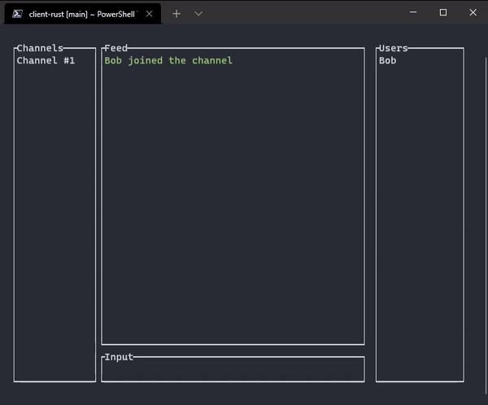
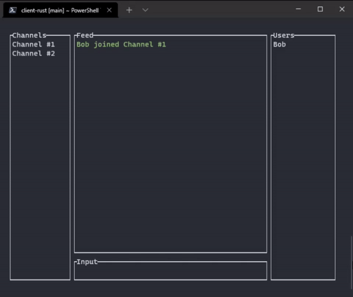

# Rust client for IRCMQ by IRCMQ boys

This is a client for IRCMQ, a clone of IRC, based on ZeroMQ, built in Rust.

## Features

- [x] Users -> Multiple users can enter a channel.

- [x] Channels -> Multiple channels can be created, joined and chatted in.

- [x] Servers -> Multiple servers can run and you can connect to one of them at a time.

- [x] TUI -> A terminal based UI based on TUI-rs.

- [x] ZeroMQ -> JSON messages over ZeroMQ sockets makes for a robust and extensible core.

## Demo of features

### General client usage



### Switching channels

How to switch channels:
```
/cc <Desired channel>
```


## Compatibility

As this is a somewhat advanced terminal user interface, it has some requirements to the terminal running it. We have tested the following terminals for compatibility.

| Terminal | Tested | Compatibility |
|--|--|--|
| CMD | ✔ | ✔ |
| Windows Terminal | ✔ | ✔ |
| PowerShell (builtin) | ✔ | ❌ |
| Alacritty | ✔ | ✔ |
| Kitty | ✔ | ✔ |
| GNOME Terminal | ✔ | ✔ |
| MacOS Terminal | ✔ | ✔ |
| Other terminals | ❌ | N/A |

## Instructions

**Clone the repo into a clean directory**
```
git clone https://git.gvk.idi.ntnu.no/course/prog2006/as/denniskr/ircmq-boys/client-rust.git
```
## Run the client

**Inside the project directory**

Build the program:
```
cargo build
```

Run with arguments (all arguments are optional, see `--help` for more):
```
cargo run -- --name Sebbern --channel Rust --server localhost
```

## Documentation

cargo doc is the standard documentation tool for a rust project. To generate the documentation, with cargo installed, you can run:
```
cargo doc
```

You can also open the documentation right away, after generating, with:
```
cargo doc --open
```

## Testing

You can run tests in the project with:
```
cargo test
```

### Install Rust on Windows

Download the installer from [rustup.rs](https://static.rust-lang.org/rustup/dist/i686-pc-windows-gnu/rustup-init.exe)

### Install Rust on Linux/MacOS

In the terminal, run:
```
curl --proto '=https' --tlsv1.2 -sSf https://sh.rustup.rs | sh
```

If you want more information about other installation methods, go to:

https://forge.rust-lang.org/infra/other-installation-methods.html


